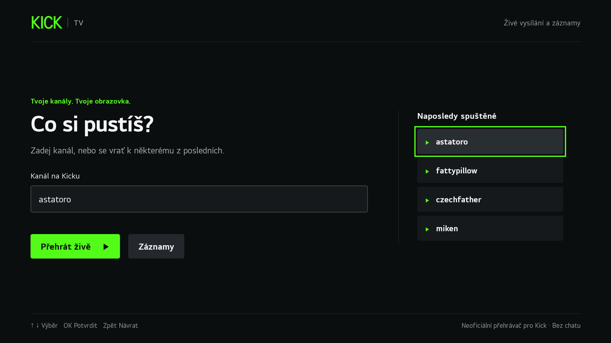
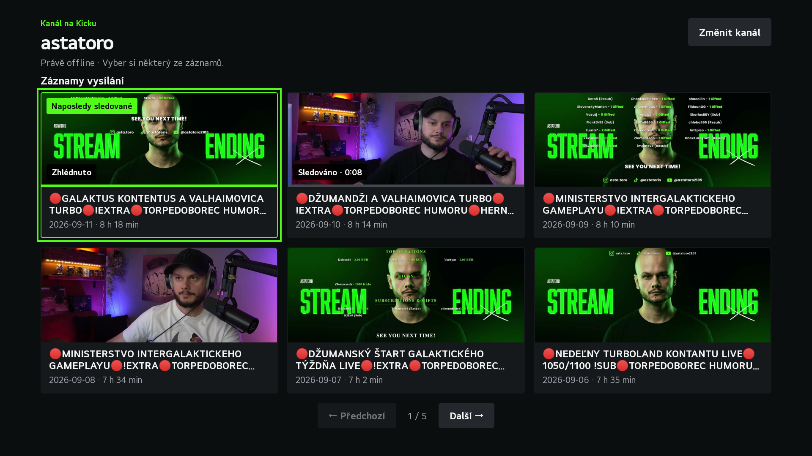
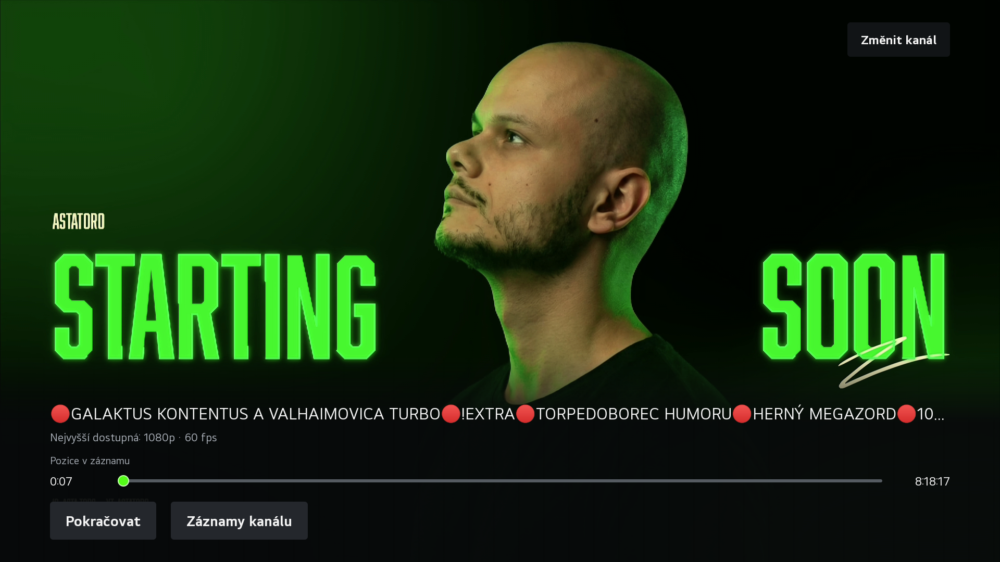

# Kick for LG webOS

[](https://github.com/JirakJ/kick-web-os-app/actions/workflows/ci.yml)

An unofficial, chat-free Kick player for LG webOS TVs. Choose a channel and watch live streams or public replays through the TV's native video player. The app and its small JavaScript service run on the TV; no computer or external proxy needs to stay on.

The interface is currently in Czech and uses Kick-inspired black and green styling.

[Download the latest installable IPK](https://github.com/JirakJ/kick-web-os-app/releases/latest).

## Features

- Live streams and public replays, including a replay picker when a channel is offline.
- Six recent channels stored locally on the TV.
- Replay thumbnails, titles, dates and durations, with six recordings per page.
- Last-watched and previously watched replay badges, with the last played position stored locally.
- A seek bar, pause/resume and remote controls; playback controls hide after six seconds of inactivity.
- Highest available quality up to 4K: 2160p → 1440p → 1080p → lower resolutions. Native adaptation remains enabled for slower connections.
- Serialized seeking, bounded recovery after media errors, request timeouts and cleanup when leaving the player.

No chat, account login, private videos or analytics.

## Screenshots

Captured from the running app on an LG webOS TV at 1920 × 1080.







## Build

Use a supported Node.js version (`^22.22.2`, `^24.15.0` or `>=26`) and npm 12. The `.nvmrc` selects Node.js 22.

```sh
nvm install
nvm use
npm install --global npm@12.0.2
npm ci
npm test
npm run package
```

The output is `dist/cz.jirak.kicktv_0.5.0_all.ipk`. It contains both the app (`cz.jirak.kicktv`) and its service (`cz.jirak.kicktv.service`), which must be installed together. CI runs the tests and uploads the built IPK as a workflow artifact.

The webOS CLI is a development dependency. The service uses the TV's built-in `webos-service` module and Node.js standard libraries; it does not ship npm dependencies. Service code remains compatible with Node.js 8.12.0 on the tested webOS 5 device.

## Install on a TV

Install the IPK with [webOS Dev Manager](https://github.com/webosbrew/dev-manager-desktop):

- On an already rooted webOSbrew TV, use its SSH/Homebrew connection. The tested installation runs without the timed LG Developer Mode application.
- On a TV using LG Developer Mode, the normal session and installation expiry rules apply.

Updates use the same app ID and preserve recent channels and replay history. This IPK is an application package, not an LG firmware update, and does not root or modify TV firmware. The app has not been published in the LG Content Store; store distribution requires LG approval.

## Controls

| Action | Control |
| --- | --- |
| Select a channel | Enter its name or `https://kick.com/channel` |
| Start live playback | **Přehrát živě**, or select a recent channel |
| Browse replays | **Záznamy**; arrows move through cards and page buttons |
| Confirm | **OK** |
| Pause/resume | **OK** on the video or seek bar; dedicated Play/Pause buttons also work |
| Seek in a replay | **← / →** on the video or seek bar, in 10-second steps |
| Jump to a position | Select a point on the seek bar with Magic Remote |
| Return to the channel's recordings | **Zpět** from playback or **Záznamy kanálu** |
| Choose another channel | **Změnit kanál** |

Controls remain visible while paused or when an error needs attention. Leaving the app releases the decoder. On return, choose **Pokračovat** to resume from the previous replay position within the same app session.

Replay cards show **Naposledy sledované** on the most recently played recording, **Sledováno · time** for previous playback, and **Zhlédnuto** when playback reached the end, including after seeking. The thumbnail bar shows the last played position, not watched-segment coverage. Selecting a replay starts it from the beginning; the saved time is a reference for the seek bar.

History starts with version 0.5.0 and keeps the 200 most recently played replays on this TV. Opening a video or seeking while paused does not mark it as watched. Progress is saved every ten seconds and when pausing or leaving; an abrupt power loss can lose the latest few seconds. Only channel/video IDs, position, duration and completion state are stored, without titles or signed media URLs. Clearing app data removes this history.

## Local development and validation

```sh
npm test
npm start
```

The preview is served at `http://127.0.0.1:8080`. Luna services and native media behavior require a webOS TV; the browser preview alone cannot verify playback.

Tests use DOM and media substitutes to check validation, history, navigation, pagination, seeking, stale events, recovery limits, lifecycle changes and service failures. They also exercise request coalescing, concurrency limits, oversized responses and disconnected clients. They do not decode real media.

Version 0.4.1 was checked on an LG 55NANO863NA running firmware 04.64.00 and webOS 5.6.2 on 12 September 2026. Device checks covered live and replay video at 1080p/60, paused seeking, rapid seek and pause/play input, channel switching, pagination, hidden controls and background/resume behavior. A four-minute playback run after the input stress test kept one decoder active without an observed error.

Version 0.5.0 was checked on the same TV for repeated emoji in Astatoro's replay titles, normal text spacing, replay badges and saved positions after restarting the app. Completion was checked by seeking the native player near the end and letting playback finish. The screenshots above show this version running on the TV. Titles keep the system font; supplementary symbols render separately to avoid the older webOS renderer corrupting repeated emoji. Available glyphs still depend on the TV's installed fonts.

This is not a guarantee of crash-free operation. Several-hour playback, router outages, screensaver behavior and actual 4K/1440p playback have not been verified. The TV reported an active, unmuted audio track; audible output was not independently checked. The quality label reports the source's highest available resolution, not a measurement of the current adaptive level.

## Architecture and limits

- `app/`: HTML/CSS, remote navigation and the native media controller.
- `service/`: validated HTTPS requests for channel information, public replays and HLS quality metadata.
- `test.cjs`: local regression and failure-path checks.

The service uses Kick's web endpoints (`/api/v2/channels/{channel}` and `/videos`), which are not a stable documented public API. Kick may change or restrict them. HTTP errors are shown in the app. Only allowlisted Kick media and thumbnail hosts are accepted, TLS validation remains enabled, and remote titles render as text.

Requests are limited to 1 MiB, 12 seconds and six concurrent connections. Playback recovery makes at most two attempts before asking the viewer to retry. These controls bound resource use and recovery; they cannot fix a platform outage or an unsupported TV decoder.

This project is not affiliated with or endorsed by Kick or LG.

References: [LG JavaScript services](https://webostv.developer.lge.com/develop/guides/js-service-usage), [HLS support](https://webostv.developer.lge.com/faq/streaming-http-live-streaming-hls-troubleshooting), [media options](https://webostv.developer.lge.com/develop/guides/mediaoption-parameter), [resuming media](https://webostv.developer.lge.com/develop/guides/resuming-media-with-mediaoption).
