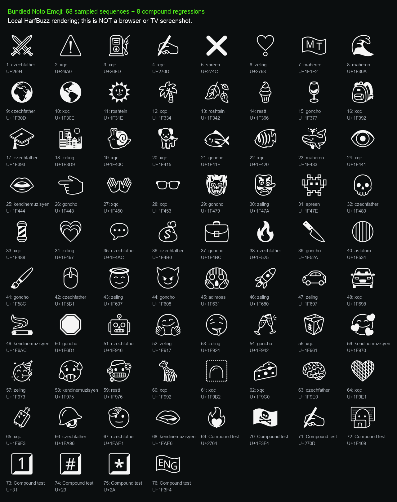

# Channel title symbol audit

Checked on 12 September 2026 for version 0.5.2, with the TV powered off.

## Sample

Public Kick channel and replay responses were requested for 92 channel slugs.
The sample contains **681 title entries from 35 channels**: 677 replay titles and
four live titles, with 490 distinct title strings. Each channel contributed up to
30 replay titles and its current live title. This is a snapshot, not a complete
archive or a check of every channel on Kick.

The initial 16 channels with titles were Czechfather, Astatoro, FattyPillow, Miken,
xQc, AdinRoss, SXB, Westcol, Roshtein, Trainwreckstv, N3on, Ac7ionman, Destiny,
Davooxeneize, Maherco and Absi (364 replay titles).

The expanded sample added these **19 previously untested channels**, with
317 title entries:

| Channel slug | Replay titles | Live titles |
| --- | ---: | ---: |
| restt | 30 | 1 |
| hendys | 6 | 0 |
| medojed | 1 | 0 |
| iceposeidon | 7 | 0 |
| cuffem | 6 | 0 |
| buddha | 24 | 0 |
| asmongold | 22 | 1 |
| lobanjica | 22 | 0 |
| wtcn | 9 | 0 |
| kendinemuzisyen | 11 | 0 |
| rraenee | 16 | 0 |
| mithrain | 5 | 0 |
| zeon | 23 | 0 |
| coscu | 10 | 0 |
| goncho | 26 | 0 |
| elded | 23 | 1 |
| spreen | 15 | 0 |
| zeling | 27 | 0 |
| gaules | 30 | 1 |

Another 48 queried slugs returned no titles in these responses. Nine had an HTTP
404 on at least one endpoint: drdisrespect, adin, train, mellstroy,
luquitasrodriguez, geromomobenavides, abu_srwal, shongxbong and abo_flah.
Those 57 slugs are not counted as title coverage. Temporary HTTP 429 responses
were retried sequentially; none remained at the end of the audit.

## Findings and fix

The titles contained **68 distinct emoji sequences**. The bundled Noto Emoji
font contains their glyphs, but six BMP symbols bypassed the app's emoji spans
and were excluded by its CSS fallback range:

| Symbols | Found on |
| --- | --- |
| ⚔️ | Czechfather |
| ⚠️ ⛽ ✍️ | xQc |
| ❌ | Spreen |
| ❣️ | Zeling |

Version 0.5.2 routes the 170 BMP emoji present in the bundled font through the
same shared title renderer as supplementary emoji. The ranges correspond to the
non-ASCII BMP entries in [Unicode's Emoji property data](https://www.unicode.org/Public/17.0.0/ucd/emoji/emoji-data.txt).
It keeps joined emoji, skin modifiers, regional and subdivision flags, and keycap
sequences together. Only keycap spans can use the emoji font for their ASCII base;
ordinary letters, numbers and spaces retain the text font. Catalog and player
titles use the same function. The font binary and dependencies are unchanged.

Newly sampled sequences include Restt's 🥶 and 🍦, KendineMuzisyen's 🫦,
Goncho's 🖌, Spreen's ❌ and Zeling's ❣️. The only additional non-ASCII
punctuation outside the emoji repertoire was Zeling's ¿; it stays in the ordinary
text font. This audit does not prove native font coverage for every writing system.

## Local evidence and limits

- All 68 sampled sequences were shaped with HarfBuzz against the exact bundled
  font, with zero missing glyph IDs, then visually inspected in the rendering below.
- `npm test` repeats each sampled sequence in both catalog and player titles,
  checking intact spans, CSS fallback coverage, safe plain text and unchanged
  routing of ordinary text and spaces.
- Eight additional compound regressions cover a heart on fire, pirate flag,
  writing hand with skin tone, woman technologist with skin tone, three keycaps
  and the England subdivision flag. These are synthetic checks, not extra sampled
  channel titles.
- The existing media, navigation, history and service regression checks also run.
  They use substitutes and do not decode real video or prove native TV rendering.

The figure renders the fallback font directly with HarfBuzz; it is **not a browser
or TV screenshot**. Native color emoji take precedence in the app where available.
No installation, TV rendering or playback check was performed for this version.
The 200-codepoint title limit remains; this sample does not establish support for
every possible Unicode sequence or a compound emoji cut at that limit.

